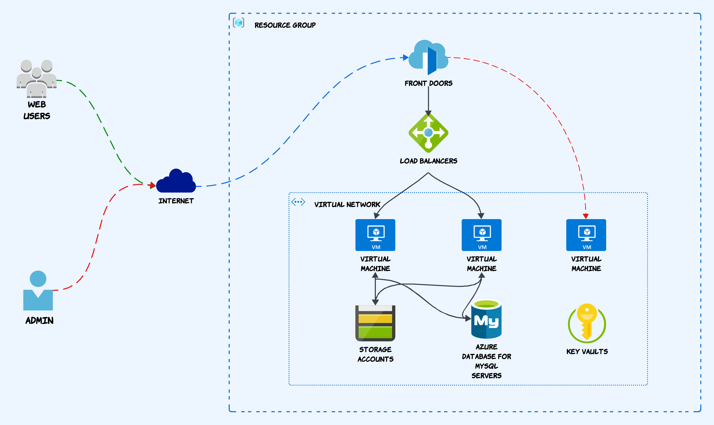

We'll start by exploring the Azure infrastructure that forms the backbone of our hosting platform. I'll explain the architectural design, the resources involved, and the key decisions made to ensure a secure and scalable environment.

### **Users & Admins:**
-  **Users** access the hosted applications over the internet.
-  **Admins** access the management portal for managing and configuring the infrastructure.
### **Azure Components:**
-  **Azure Front Door**
Azure Front Door handles incoming web traffic, providing load balancing, SSL offloading, and possibly Web Application Firewall (WAF) capabilities. It ensures that traffic is efficiently routed to the appropriate resources in the backend. URL-based routing is handled by Azure Front Door.
-  **Load Balancer**
The Load Balancer distributes incoming traffic across multiple Virtual Machines (VMs) to ensure high availability and reliability of services. It acts as an intermediary to balance the load and prevent any single VM from being overwhelmed.
#### **Backend Infrastructure:**
-  **Virtual Machines (VMs):**
There are two VMs that act as web servers hosting the application. The Load Balancer directs traffic to these VMs to manage the load. These VMs may be running web servers, application services, or other related processes.
-  **Database:**
The architecture includes a managed database service, Azure Database for MySQL, which stores the application data accessed and manipulated by the VMs. This database is critical for handling the persistent storage needs of the application.
-  **Storage:**
An Azure Storage account is used for persistent file sharing across web servers, meeting the application's storage needs.
-  **Key Vault:**
Azure Key Vault is employed for managing secrets, encryption keys, and certificates. It ensures that sensitive information, such as database credentials, API keys, and SSL certificates, is securely stored and accessed by the VMs or other services.
#### **Virtual Network (VNet):**
- All backend components (VMs, Database, Storage, Key Vault) are encapsulated within a Virtual Network (VNet), providing network isolation and security. The VNet allows the resources to communicate securely while being protected from the public internet.
### Summary:
This architecture is designed for a scalable and secure web hosting platform on Azure. Users access the platform through Azure Front Door, which routes traffic via a Load Balancer to multiple VMs. These VMs interact with a database, storage, and a Key Vault within a secure Virtual Network. Admins have a dedicated path to securely manage the infrastructure.
### Resource Plan
Lest asume your working on project names **star**, you are deploying **prod** envirnment in **Central India**

In next part we will see how to deploy this environment using **terraform**. In Terraform we will user Project Name & Environment variable to build resources names. Also we will be considering [Azure Naming Conventions](https://learn.microsoft.com/en-us/azure/cloud-adoption-framework/ready/azure-best-practices/resource-naming)

Below table will give an idea how resources will be named.

| Sr. No. | Resource Type | Resource Name | Resource SKU |
|--|--|--|--|
| 1 | Resource group | rg-str-prd-inc | NA |
| 2 | Front Door and CDN profile | fd-str-prd-inc | Azure Front Door Standard |
| 3 | Network security group | nsg-str-prd-inc | NA |
| 4 | Virtual network | vnet-str-prd-inc | NA |
| 5 | Public IP address | pip-vm-str-prd-inc | Standard |
| 6 | Network Interface | nic-vm-str-prd-inc | NA |
| 7 | Virtual machine | vm-str-prd-inc | Standard_F2 |
| 8 | Disk | osdiskvmstrprdinc | Premium SSD LRS |
| 9 | Disk | diskvmstrprdinc | Premium SSD LRS |
| 10 | Public IP address | pip-str-prd-inc | Standard |
| 11 | Load balancer | lbi-str-prd-inc | Standard |
| 12 | Network Interface | nic-str-prd-inc-0 | NA |
| 13 | Virtual machine | web-str-prd-inc-0 | Standard_F2 |
| 14 | Disk | osdiskwebstrprdinc0 | Premium SSD LRS |
| 15 | Disk | diskwebstrprdinc0 | Premium SSD LRS |
| 16 | Network Interface | nic-str-prd-inc-1 | NA |
| 17 | Virtual machine | web-str-prd-inc-1 | Standard_F2 |
| 18 | Disk | osdiskwebstrprdinc1 | Premium SSD LRS |
| 19 | Disk | diskwebstrprdinc1 | Premium SSD LRS |
| 20 | Storage account | ststrprdinc | Premium LRS FileStorage |
| 21 | Private DNS zone | str.mysql.database.azure.com | NA |
| 22 | Azure Database for MySQL flexible server | mysql-str-prd-inc | General Purpose, D2ads_v5, 2 vCores, 8 GiB RAM, 20 GiB storage |
| 23 | Key vault | kv-str-prd-inc | Standard |